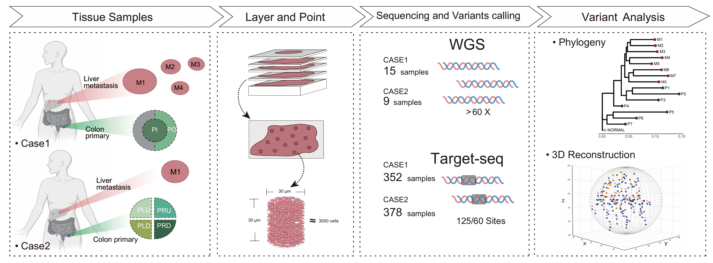

# Dense Volumetric Mapping Reveals Spatio-Temporal Evolutionary Trajectories in Colorectal Cancer Metastasis

This repository contains the analysis code and key data files to reproduce the findings presented in our manuscript, "Dense Volumetric Mapping Reveals Spatio-Temporal Evolutionary Trajectories in Colorectal Cancer Metastasis".

## Project Overview

Metastasis is a complex evolutionary process that remains the primary cause of cancer-related mortality. In this study, we employed a dense, three-dimensional, crypt-scale sampling strategy (DeVoCS) to reconstruct the high-resolution evolutionary history of colorectal cancer liver metastasis in two representative cases. Our key findings reveal that:

1.  **Metastasis is an early and continuous process**, initiating long before clinical detection and creating a substantial, clinically occult micrometastatic burden.
2.  **Metastases are founded by multiple, genetically distinct clones (polyclonal seeding)**, suggesting that clonal cooperation may be essential for successful colonization.
3.  **Metastatic tumors evolve along distinct spatial trajectories** following seeding, forming either spatially segregated clonal territories or highly intermixed architectures, a dynamic that appears to be driven by intrinsic cell motility.

This work reframes metastasis not as a singular, late-stage event, but as an early, systemic, and cooperative process, offering new perspectives for therapeutic intervention.

## Uploading
The code upload is underway and is projected to finish by October 13, 2025.
